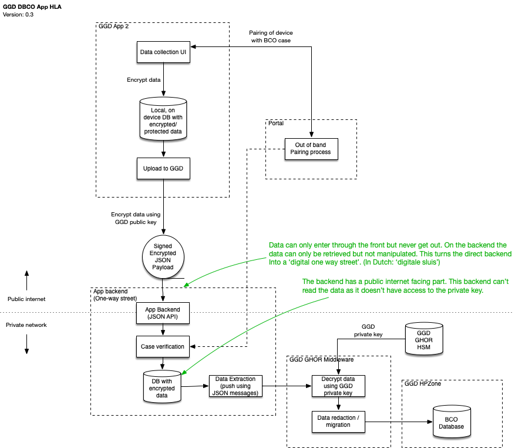
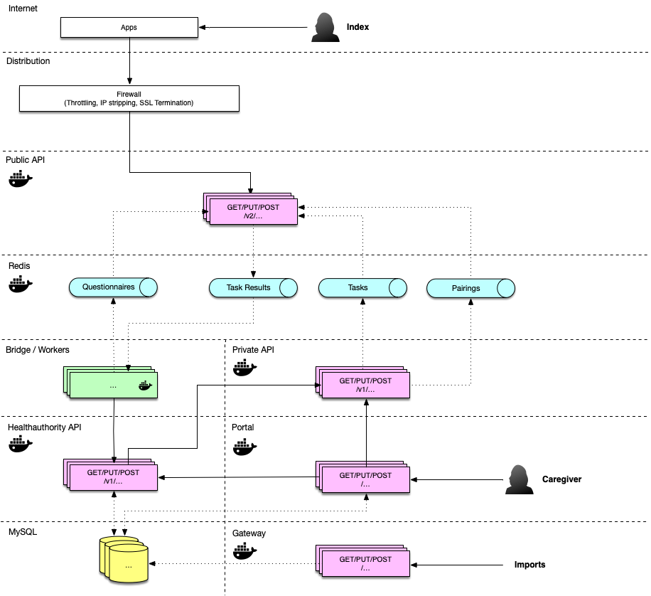

#  GGD Contact App - Solution Architecture

**Version:** 0.1 (Work in Progress)

# Introduction

The Dutch Ministry of Health, Welfare and Sport is developing an app (GGD Contact) to aid the GGD in their contact tracing (Dutch: Bron & Contact Onderzoek, BCO) efforts. This document describes the functional and technical architecture of the DBCO app.

This document is a work in progress and will be adjusted during the project.

# Table of contents

- [COVID-19 DBCO App - Solution Architecture](#covid-19-dbco-app---solution-architecture)
- [Introduction](#introduction)
- [Table of contents](#table-of-contents)
- [Requirements](#requirements)
  * [GGD Requirements](#ggd-requirements)
  * [General Guiding principles](#guiding-principles)
- [Key characteristics](#key-characteristics)
- [High Level Architecture](#high-level-architecture)
- [Flows](#flows)
  * [Onboarding](#onboarding)
  * [Case Creation](#case-creation)
  * [Collecting data](#collecting-data)
  * [Submitting data to the backend](#submiting-data-to-the-backend)
  * [Making data available to GGD](#making-data-available-to-GGD)
- [System Landscape](#system-landscape)
- [Security & Privacy](#security--privacy)
  * [Overview](#overview)
  * [Attack Surface Minimisation](#attack-surface-minimisation)
  * [Data cleanup](#data-cleanup)
  * [App/Device Verification](#appdevice-verification)
- [Backend](#backend)
  * [Backend overview](#backend-overview)
  * [Public API](#public-api)
  * [Private API](#private-api)
  * [Workers](#bridge---workers)
  * [MySQL](#mysql)
- [App Considerations](#app-considerations)
  * [Native vs hybrid development](#native-vs-hybrid-development)
  * [Lifecycle Management](#lifecycle-management)

# Requirements

## Design Input

We are basing the requirements of the first version on a problem domain, defined in an agile process in close cooperation with the design team. The designs in the design repository (https://github.com/minvws/nl-covid19-dbco-app-design) and this solution architecture together reflect the outcome of this agile process.

## General Guiding principles

In addition to the requirements, we have defined a number of guiding principles that a solution must adhere to. This means that this project has a number of key contextual requirements that drive or otherwise define the architecture or are used as a benchmark:

* [Baseline Informatiebeveiliging Overheid 1.04](https://bio-overheid.nl/media/1400/70463-rapport-bio-versie-104_digi.pdf)

* [Algemene Verordening Gegevensbescherming (AVG)](https://autoriteitpersoonsgegevens.nl/sites/default/files/atoms/files/verordening_2016_-_679_definitief.pdf) 

* [Handreiking Mobiele App Ontwikkeling en Beheer 3.0](https://www.noraonline.nl/images/noraonline/a/a5/Handreiking_Mobiele_App_3.0.pdf) 

* [Web Content Accessibility Guidelines 2.1](https://www.w3.org/TR/WCAG21/)

* [NCSC beveiligingsrichtlijnen voor webapplicaties](https://www.ncsc.nl/documenten/publicaties/2019/mei/01/ict-beveiligingsrichtlijnen-voor-webapplicaties)

* [NCSC beveiligingsrichtlijnen voor mobiele apps](https://www.ncsc.nl/documenten/publicaties/2019/mei/01/ict-beveiligingsrichtlijnen-voor-mobiele-apps)

# Key characteristics

## Privacy by design

For the app we follow a Privacy by Design approach. This means:

* We will not collect more data than necessary. 
* Data that we do collect is protected with appropriate measures
* We apply end-to-end security

## Open Source

All source code will be made available on the ministry's GitHub account.

# High Level Architecture

## Concept

The core concept of the app is described with the following steps:

1. When a user is tested positive, he is contacted by the GGD to do contact tracing (who have you met, who should we warn etc.)
2. In the current situation, this contact information is handed over orally over the phone.
3. The GGD Contact project aims to deliver an app that saves time during that phone call and increases the quality of the data.
4. To this end, during the conversation the BCO staff will still determine which people need to be contacted, but they will leave filling in the contact details to the user.
5. The user receives, in his app, the list of people he should supply contact info for, will fill out the details, and send back the results.

## Solution

The following diagram shows a high level concept of the solution.

The core of the solution revolves around a 'digital one way street' (data-sluis) that allows uploads of contact data, in an encrypted form, that can only be decrypted by the system that needs the data. Data can never be downloaded. Edits to the data by the user happen locally on the user's device only.

# Flows

This chapter describes the core flow that we are following, which is derived from the requirement, UX research and various discussions with the health authority.

## Data preparation

A user that installs the app before getting a positive test result can start to use the app to prepare for the BCO investigation. Because there's no specific case, this part of the flow is 'generic', in the sense that all users will get the same set of basic questions. Questions can, for example, be to list the people in your household.

The following diagram depicts the steps for this flow:

It is important that in this flow there is only generic interaction with the backend: to retrieve an app configuration and the list of initial questions. The answers to the initial questions stay local on the device and may help speed up the BCO conversation. 

## Pairing the device case with the BCO case

Once there is a BCO conversation the user is asked if the app is already installed or if not, to install it. There are 2 flows for pairing a device with the BCO case. Which one is used depends on wether the user already installed the app prior to the BCO conversation. 

If the user hasn't installed the app yet, the following flow is used:
- The operator will generate a pairing code for the BCO case.
- This code is read out loud to the user. 
- The user installs the app after the call.
- The user pairs the app with the BCO case by entering the code at first start-up.

The following diagram depicts this pairing process:

If the user already installed the app prior to the BCO conversation:
- The user chooses to share data with the BCO expert.
- The app retrieves a pairing code from the server.
- The user reads the pairing code out loud to the BCO expert.
- The operator enters the pairing code for the BCO case.
- The app receives a one-time pairing code from the server (similar to the one normally communicated by the BCO expert). 
- The app finishes the pairing flow by calling the normal pairing functionality with the received code.

We call this the reverse pairing flow. The following diagram depicts this process:

After the reverse pairing flow is finished the user is asked if already entered data should be shared with the operator immediately. If the user chooses to do so the operator will receive this data instantly in the portal (see [Submitting data to the backend](#submiting-data-to-the-backend)). 

## Collecting data

During the BCO conversation, additional tasks will have been defined by the BCO expert. They might have talked about that goalkeeper in the football team that you accidentally hugged after a score, so they might ask you to collect the data for that goalkeeper. These tasks are created using the GGD Contact portal and the app retrieves them during/after the call.

The following diagram depicts the process of retrieving these tasks and presenting them to the user.

During this step we ask permission to access the contact list on the device. This permission is used to suggest contacts based on the task. E.g. if the task from the BCO conversation is 'please provide contact details for John D', the contact list will suggest 'Did you mean John Doe?'. Only contacts actually selected are sent to the backend. On some platforms, if permission is not desired, we can fall back to the standard OS contact picker dialog. This will allow the user to still select a contact albeit without optimized filtering.

## Submitting data to the backend

When the user has completed the tasks by filling out the contact details, the user will upload them to the backend. The following diagram depicts the upload process:

The user can upload multiple times during the window that the upload is open. This is useful if the user needs more time to collect additional details. Each time the data is uploaded, the previous version will be overwritten.

# Security & Privacy

## Overview

The details surrounding the security and privacy implementation of the app is laid out in the document [‘Crypto Architecture’](Crypto Architecture.md). While the details and rationale surrounding the choices can be found in that document, for this solution architecture we have outlined the key principles from the preliminary version in the following diagram.

Todo

Each part of the diagram tries to address a number of key aspects:

* Source authenticity: how can we ensure that data comes from a known / trusted source

* Destination authenticity: how can we ensure that data gets sent to a known / trusted source

* Data integrity: how can we ensure that the data has not been tampered with.

* Data protection: how can we ensure that only authorized people can access the data

TODO: Do we want a TOR network in the mix?

## Attack Surface Minimisation

We practice 'attack surface minimisation' to reduce risks. This means we pay attention to the following:

* No more API calls than necessary for the operation of the app (no exposure of generic REST endpoints)
* No more fields in input/output than necessary (calls will provide specific answers instead of generic entities)
* Internal / machine to machine API calls separated from public / app to backend API calls
* Where possible, deliver data via push between APIs instead of via pull.

## Data cleanup

We don't want to keep data around longer than necessary. Therefor we have defined a few rules we apply for data cleanup:

### Backend cleanup

* Pairings are automatically wiped if the upload window has expired.
* Prepared tasks are automatically wiped if the upload window has expired.
* Invalid submissions are not stored (e.g. after token expiration etc.)

### Apps cleanup

* Paired case is automatically wiped after 14 days.
* User can reset the app manually.

## App/Device Verification

This part is taken directy from the CoronaMelder architecture, and we follow the route we have taken there:

The Google Reference Implementation of a backend for exposure notification suggests the use of DeviceCheck (iOS) and Safetynet Attestation (Android) to validate if a request comes from a genuine android device and/or from the official app:

* [https://github.com/google/exposure-notifications-server/blob/master/docs/server_functional_requirements.md](https://github.com/google/exposure-notifications-server/blob/master/docs/server_functional_requirements.md)

The documentation for DeviceCheck and Safetynet Attestation can be found here:

* [https://developer.apple.com/documentation/devicecheck](https://developer.apple.com/documentation/devicecheck)

* [https://developer.android.com/training/safetynet/attestation](https://developer.android.com/training/safetynet/attestation)

We have decided not to apply these platform specific checks. First, it relies on a server API at Apple and Google, which can be down and could be a privacy risk.

Second, the Android Developer blog states: 

"*In other words, not all users who fail attestation are necessarily abusers, and not all abusers will necessarily fail attestation. By blocking users solely on their attestation results, you might be missing abusive users that don't fail attestations. Furthermore, you might also be blocking legitimate, loyal customers who fail attestations for reasons other than abuse*" (NOTE:  https://android-developers.googleblog.com/2017/11/10-things-you-might-be-doing-wrong-when.html)

The safetynet attestation documentation further states about attestation failure: *"Most likely, the device launched with an Android version less than 7.0 and it does not support hardware attestation. In this case, Android has a software implementation of attestation which produces the same sort of attestation certificate, but signed with a key hardcoded in Android source code. Because this signing key is not a secret, the attestation could have been created by an attacker pretending to provide secure hardware"* (NOTE:  https://developer.android.com/training/articles/security-key-attestation)

This leads us to believe that when applying these checks, we introduce risks and dependencies while not gaining a substantial amount of security.

# Backend  

## Backend overview

The following diagram describes the overall backend architecture.

## Public API

The public API is the API that is accessible via the public internet, by the GGD Contact apps. The architecture for the public API is described in detail [here](public-api/README.md).

## Private API

The private API is the interface between the GGD Contact ecosystem and the public internet, via a non-public connection. It allows pushing data (e.g. case tasks) to the Redis cache that is shared between the public and private API. The architecture for the private API is described in detail [here](private-api/README.md).

## Bridge / workers

The bridge and other workers are at the same level as the private API. They are autonomous, there are no outside API calls / connections to these workers, and they deliver the data via a private network to the destination. The following diagram describes these workers.

TODO:

## Health Authority API

The health authority API is used for delivering data via the bridge to the GGD Contact portal. It is also used for exporting data from the GGD Contact portal to the public API via the private API. The architecture for the health authority API is described in detail [here](healthauthority-api/README.md).

## Portal
The portal is the caregiver interface to the GGD Contact system. The user interface is written in VueJS and interfaces with a PHP backend. The architecture for the health authority API is described in detail [here](portal/README.md).

## MySQL
Case related data is stored in a MySQL database. Data containing personal information is stored encrypted. Central to the ER-diagram is the covidcase table which is a 1 on 1 reference to an investigation of a caregiver on an infected person. This table contains a lot of questions registered by the caregiver. Questions and answers asked by the app are initially stored in the tables 'question' and 'answer'. Questions can be grouped in questionnaires. Most notable tables to support source and contact research are the 'context' and 'task' tables. The 'context' table stores the whereabouts of the infected person. The 'task' table records all contacts to other persons being either source of infection or infected by the index.

###ER Diagram

### Table description
| Table             | Description |
|-------------------|---|
| answer            | Contains answers to the questions asked to the index by the app |
| answer_option     | When a question is of type choice of multiplechoice, the answer options can be stored here |
| bcouser           | Caregiver who has access to the portal message  |
| client            | Stores OAuth access tokens  |
| context           | Time and places where an infected person has been. Data is stored in incrypted format. |
| context_section   | Relation table between context and section  | 
| covidcase         | Contains case data about an infected person and meta data. Besides meta-data like caregiver assignment and status this table contains a large part of answers to questions which are asked by the caregive. Answers are stored here in encrypted fields.  |   |
| event             | Events are registered during the lifetime of a covid case to support RIVM metrics  |
| export            | Reference to exports of events. Exports are stored in to encrypted files and send to RIVM. |
| failed_jobs       | Reference to periodic scripts which have failures and should be investigated |   |
| mail_template     | Contains templates used for sending emails  |
| message           | Stores messages send by email to the infected person |
| moment            | Datetime reference(start,end)  related to a context  |
| note              | General remarks a caregiver whishes to store **Still used?**  |
| organisation      | GGD organisations a caregiver may belongs to  |
| place             | A reference to a location with address data |
| question          | A question which is asked by the app to the infected person  |
| questionnaire     | A set of questions. A version is stored to keep reference to older questionnaires  |   |
| section           | More delimiting the referenced place   |
| situation         |   |
| situation_case    |   |
| situation_place   |   |
| task              | A generic table to store data needed for investigation. Currently used to store the contacts an infected person has had. Questions about the contact are stored in encrypted fields.   |
| user_organisation | Reference table between bcouser and organisation  |

# App Considerations

## Native vs hybrid development

Mobile apps will be implemented as native applications, with Swift as the language used for iOS development and Kotlin for Android development.

We have carefully considered whether to do native development or use a cross platform technology, and the following arguments were leading:

* There are no requirements or constraints that dictate the use of cross platform tools.

* The available development team has sufficient capability in native app development.

* It is expected that, should we need help from Google or Apple to resolve issues while implementing this app, they can do so more efficiently if we use the development stack provided by the vendors.

* In order to ease [security] code-reviews and thus keeping them accessible to a wider audience, it is prudent to keep the app's stack and usage of programming paradigms as vanilla and lean as possible.

## Lifecycle Management

Apps run on the user’s device and updates require a review process that is not entirely under our control. To mitigate these factors that are outside our control, apps should implement a form of lifecycle management. This includes the following features:

* Configuration values or content that are expected to change should be retrieved from a server.

* Apps should offer a ‘forced upgrade’ (i.e. if a new version is available that fixes a critical bug, it should be possible to force the user to upgrade). 

