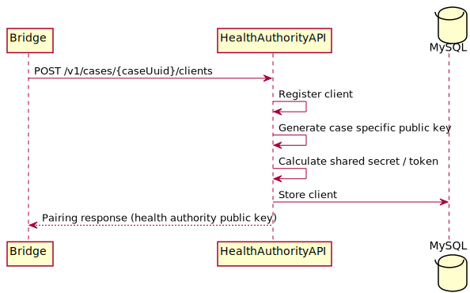
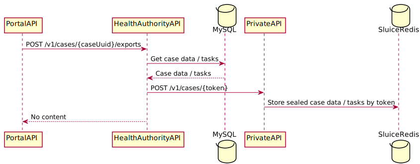
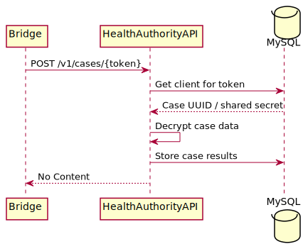

#  GGD Contact - Private API

**Version:** 0.1 (Work in Progress)

## Introduction

The Dutch Ministry of Health, Welfare and Sport is developing an app (GGD Contact) and portal to aid the GGD in their contact tracing (Dutch: Bron & Contact Onderzoek, BCO) efforts. This document describes the functional and technical architecture of the **Health Authority API** for the DBCO app.

Before you read this document, make sure you have read [this document](../Solution Architecture GGD Contact.md) first.

This document is a work in progress and will be adjusted during the project.

## Setup

The Health Authority API is written in PHP (>= 7.4). It uses the [Slim Framework](https://www.slimframework.com) to minimize the number of dependencies while still having a solid base to build on. We use [PHP DI](https://php-di.org) as dependency injection container.

The Health Authority API lives in the domain of the GGD Contact Portal and as such has access to case data in the relational database. 

In the future we want to integrate the Health Authority API in the Portal codebase because a lot of code is already shared between both code bases and this could be further improved upon by merging the two codebases. 

## API specs

The definition of the Private API can be found in [this Swagger File](healthauthority-api.yaml).

## Flows

The following sequence diagrams describe the flows through the different systems for the different API calls.

### Register client

Part of the pairing process is registering the client. This is called from the Public API via the Bridge after the pairing code has
already been verified. This flow looks as follows:

### Export case to client

After the pairing process is finished the portal will ask the Health Authority API to export the case tasks to the sluice. This flow looks as follows:

**NOTE**: 
This could be done directly from the Portal API because all this data is available and accessible there as well. However to re-use the same logic from other places it has been decided to make this functionality available through this API call. 

### Submit case results

When an index submits data through the Public API it will be pushed through the bridge and stored using the following flow:

