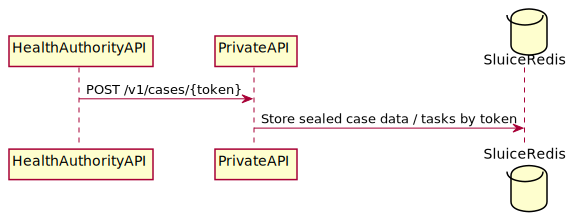

#  GGD Contact - Private API

**Version:** 0.1 (Work in Progress)

## Introduction

The Dutch Ministry of Health, Welfare and Sport is developing an app (GGD Contact) and portal to aid the GGD in their contact tracing (Dutch: Bron & Contact Onderzoek, BCO) efforts. This document describes the functional and technical architecture of the **Private API** for the DBCO app.

Before you read this document, make sure you have read [this document](../Solution Architecture GGD Contact.md) first.

This document is a work in progress and will be adjusted during the project.

## Setup

The Private API is written in PHP (>= 7.4). It uses the [Slim Framework](https://www.slimframework.com) to minimize the number of dependencies while still having a solid base to build on. We use [PHP DI](https://php-di.org) as dependency injection container.

The Private API is used to push data from other systems to the shared Redis instance between the Public and Private API. As such it only has access to this Redis server and doesn't have access to the relational database.

## API specs

The definition of the Private API can be found in [this Swagger File](private-api.yaml).

## Flows

The following sequence diagrams describe the flows through the different systems for the different API calls.

### Register case for pairing

A caregiver can register a case for either normal or reverse pairing from the portal using the following flow:

**NOTE:**
To complete the normal pairing flow it is now up to the index to enter the pairing code in the app after installation. If this doesn't happen within a certain time window, the registration will automatically expire.

When using the reverse pairing flow the app should be polling the pairing request status at this time, so the reverse pairing will complete almost instantly after the caregiver has entered the reverse pairing code in the portal. 

### Update case data/tasks for index

After a case is paired with the app the portal will push certain case data and tasks to the app using this flow:

See the flow for the Health Authority API for more details.

**NOTE**: 
As this data is only pushed to Redis it is up to the app to fetch this data at a certain interval. The app will fetch this data for the first time right after pairing has been completed.

