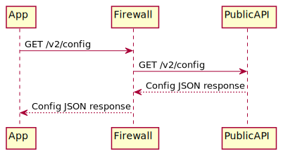
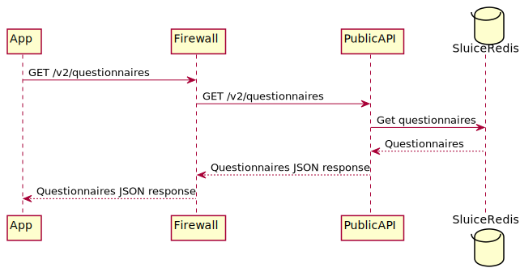
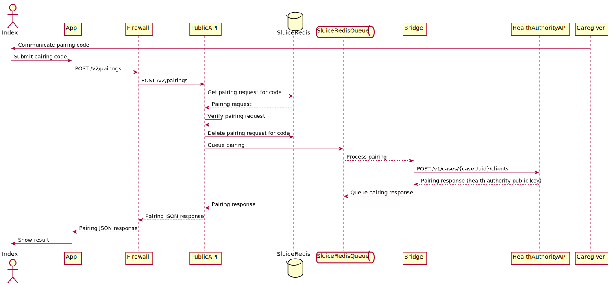
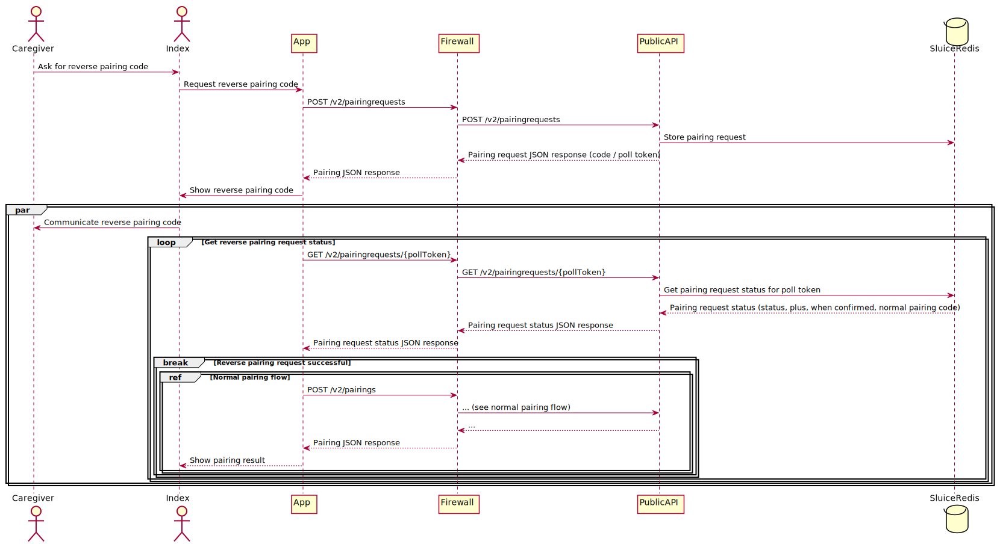
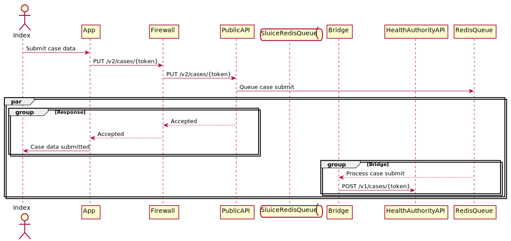

#  GGD Contact - Public API

**Version:** 0.1 (Work in Progress)

## Introduction

The Dutch Ministry of Health, Welfare and Sport is developing an app (GGD Contact) and portal to aid the GGD in their contact tracing (Dutch: Bron & Contact Onderzoek, BCO) efforts. This document describes the functional and technical architecture of the **Public API** for the DBCO app.

Before you read this document, make sure you have read [this document](../Solution Architecture GGD Contact.md) first.

This document is a work in progress and will be adjusted during the project.

## Setup

The Public API is written in PHP (>= 7.4). It uses the [Slim Framework](https://www.slimframework.com) to minimize the number of dependencies while still having a solid base to build on. We use [PHP DI](https://php-di.org) as dependency injection container.

The public API doesn't communicate directly with any of the other APIs of the GGD Contact system. Data is either made available by the other systems in Redis or stored/pushed in Redis by the public API itself. No relational database is used.

## API specs

The definition of the Public API can be found in [this Swagger File](public-api.yaml).

## Flows

The following sequence diagrams describe the flows through the different systems for the different API calls.

### Fetch configuration

At start-up, and just before beginning the BCO flow, the app needs to fetch the lastest configuration from the server. This looks as follows:

### Fetch questionnaires

At start-up, and just before beginning the BCO flow, the app needs to fetch the lastest questionnaires from the server. This looks as follows:

### Normal pairing

The normal pairing flow is used when the index doesn't have the GGD Contact app installed yet when called for the first time by the caregiver. The caregiver will communicate a pairing code to the user that can be used to pair the app to the index' case within a certain time window after the initial phone conversation.

### Reverse pairing

The reverse pairing flow is used when the index already has the GGD Contact app installed when the caregiver calls for the first time. The index is asked to communicate a pairing code to the caregiver, which will then be entered by the caregiver in the portal.

### Submitting data

After the pairing is done and the index has entered all the requested data using the app, the data can be submitted to the health authority using the given flow:

